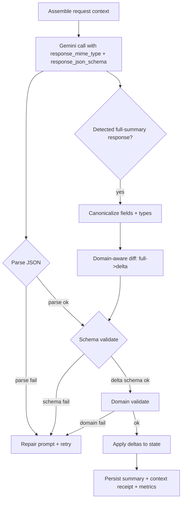
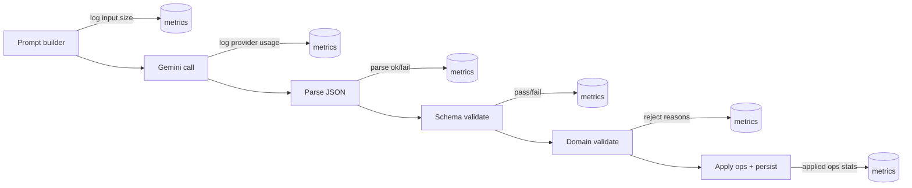

# Forcing Gemini to Emit Canonical JSON for a Summarizer

## Executive summary

The most reliable way to make **Google Gemini** return JSON that **strictly conforms** to a canonical schema is to combine **API-level structured output enforcement** (Gemini’s `response_mime_type: application/json` + `response_json_schema` / `responseSchema`) with **server-side validation + repair loops**. Gemini’s official Structured Outputs documentation states the model will generate a **syntactically valid JSON string matching the provided schema**, and that outputs follow the **key order** of the schema. citeturn9view2turn5view0

For workloads like your summarizer (incremental “delta” updates, protected fields, supersession rules), prompt-engineering alone is not robust enough: even when schema-conformant JSON is produced, you still need **domain-specific constraints** that JSON Schema can’t fully express (e.g., “don’t rewrite protected text; only supersede”). Gemini’s own best practices explicitly recommend validation and robust error handling, noting that structured output guarantees JSON syntax but not semantic correctness. citeturn5view0

A strong production architecture therefore has three layers:

- **Hard structural constraint**: Gemini Structured Outputs with a **delta-only schema** (not a full summary schema). citeturn9view2turn3view0  
- **Optional tool-assisted constraint**: Gemini Function Calling with `mode='ANY'` to force the model to emit parameters matching your tool schema (another structural constraint pattern). citeturn11view0turn11view1  
- **Safety net**: server-side validation, logging, repair/regeneration, and if needed **normalization + domain-aware diffing** to convert full-schema outputs into deltas (and to reject protected-field rewrites).

If your exact Gemini model or API surface is unspecified, the report provides “works on Gemini API and Vertex AI” variants and calls out model-specific caveats (e.g., Gemini 2.0 `propertyOrdering`, Gemini 3 model lifecycle changes). citeturn5view0turn13view0

## What official sources say about structured output constraints

### Gemini Structured Outputs and JSON Schema constraints

Gemini’s official Structured Outputs guide describes a first-class mechanism to generate JSON by setting `response_mime_type` to `application/json` and providing a `response_json_schema`. It states that the model will generate a **syntactically valid JSON string matching the provided schema**, and that outputs are produced **in the same order as schema keys**. citeturn9view2turn4view0

Gemini also documents that structured outputs support only a **subset of JSON Schema** and that unsupported properties are ignored; additionally, very large or deeply nested schemas may be rejected. citeturn5view0turn9view2

Practical consequence for your summarizer:

- Put the “shape contract” in the schema: required fields, enums, `additionalProperties: false`.
- Keep the schema reasonably small (especially important for long-context summarizers).

### Gemini API generation config, schema support, and decoding controls

The Gemini `models.generateContent` API reference enumerates generation configuration fields including `responseMimeType`, schema fields (`responseSchema` and JSON-schema alternatives), and decoding controls such as `maxOutputTokens`, `temperature`, `topP`, `topK`, and `seed`. citeturn3view0turn2view0

It also explicitly lists which JSON Schema properties are supported by the JSON-schema alternative (`$defs`, `$ref`, `type`, `enum`, `properties`, `additionalProperties`, `required`, etc.). This matters because **schema features you rely on must be inside Gemini’s supported subset**. citeturn3view0

Gemini also supports a `systemInstruction` field (SDK and REST variants) to provide persistent instruction framing. citeturn2view1

### Vertex AI and token-budget realities for schema constraints

Google Cloud’s Vertex AI structured output docs include key operational constraints:

- **Schema size counts toward the input token limit**
- Complex schemas can cause `InvalidArgument: 400`
- Suggested mitigations include shortening property names, flattening nested arrays, reducing optional properties and constraints citeturn12view0turn12view2

They also note a practical anti-hallucination technique: set fields nullable so the model can return `null` where context is insufficient, reducing forced guessing. citeturn10view1turn12view1

### Tool-based structured output as a “guaranteed shape” strategy

Gemini Function Calling supports **forced function calling**. The docs show you can set a tool config that forces the model to call *some* function (`mode='ANY'`), optionally restricting to allowed function names. citeturn11view0turn11view2

This is relevant because a “record_summary_delta” tool whose parameters encode your canonical schema can serve as a second structural enforcement mechanism (similar to the “strict tools” pattern on other platforms). citeturn11view0

### Cross-provider structured output best practices that generalize well

OpenAI’s Structured Outputs (`response_format: json_schema` with `strict: true`) is explicitly positioned as guaranteeing schema adherence (vs JSON mode only guaranteeing valid JSON). citeturn6view0turn1view4

Anthropic documents a comparable pattern: using tools for JSON output and enabling strict schema validation on tool inputs. citeturn8search2turn1view5

Why this matters for Gemini: it reinforces the engineering consensus that **schema enforcement belongs in the API contract + validation layer**, not only in the prompt.

### Academic/industry evidence for constrained decoding and formal-structure outputs

For text-to-SQL and other formal languages, research like PICARD demonstrates that **constrained decoding** (rejecting invalid tokens during generation) can dramatically reduce invalid outputs. citeturn7search0turn7search3

In practice, many “guaranteed JSON” approaches (e.g., Outlines, JSON grammar decoders) apply the same idea: constrain the output space to a grammar/schema. citeturn7search2turn7search5turn6view0

Gemini Structured Outputs and Function Calling are best understood as **hosted constrained-output mechanisms**, which is why they typically outperform prompt-only formatting for strict JSON.

## Prompt and schema enforcement strategies for Gemini

### Strategy hierarchy

For “strict canonical JSON,” Gemini-oriented strategies fall into four tiers with increasing robustness:

1. **Prompt-only JSON** (weak): “output JSON only” instructions; fragile under long-context and high entropy.
2. **JSON mode** (medium): `response_mime_type: application/json` without a schema; enforces JSON syntax but not field-level contract. citeturn3view0turn14view0
3. **Structured Outputs with JSON Schema** (strong): `response_mime_type` + `response_json_schema` / `responseSchema`; enforces schema-shaped JSON. citeturn9view2turn2view0turn14view0
4. **Forced function calling** (strongest in many pipelines): force a tool call (`mode='ANY'`) whose parameters are the canonical schema. citeturn11view0turn11view2

In your summarizer context, the best baseline is tier 3 or 4, plus validation.

### Schema design patterns that reduce “field drift”

These patterns are grounded in what Gemini supports and what its docs recommend:

- Use **strong typing**: enums for status fields; integer vs string where you can. citeturn5view0turn3view0  
- Use `required` + `additionalProperties: false` to prevent extra keys (Gemini supports both). citeturn3view0turn9view2  
- Prefer **short names** and limit nesting to reduce schema complexity errors and token cost. citeturn12view0turn5view0  
- Prefer nullable fields where you want “unknown” instead of hallucinated values (Vertex guidance). citeturn10view1turn12view1  
- If targeting Gemini 2.0 structured outputs: include explicit `propertyOrdering` as documented. citeturn5view0

### Instruction framing in Gemini requests

Gemini supports a `systemInstruction` facility in its generation config, which you should use for invariant constraints:

- “Output must conform to schema”
- “Return deltas only”
- “Never rewrite protected fields; only supersede”
- “No markdown, no commentary”

Per-run content (new messages, current summary snapshot, IDs) belongs in `contents` (user message) and should be placed **after** the data context, consistent with Gemini 3 prompting recommendations to put instructions/questions at the end when working with large contexts. citeturn2view1turn13view0

### Decoding and token-budget guidance for a delta summarizer

Gemini exposes `maxOutputTokens` and typical sampling controls. citeturn3view0turn2view0

For strict structured JSON:

- Start with **low-variance decoding** (commonly `temperature=0`), but treat this as an empirical choice. Gemini 3 guidance warns that explicitly low temperatures can cause looping or degrade performance in some complex tasks, suggesting removing the temperature override and using defaults in those cases. citeturn13view0turn3view0  
- The safest practice is: **rely on schema constraints for structure**, then tune temperature for stability vs quality while watching error rates.

Token budgeting:

- Ensure your schema is small enough (schema tokens count toward input limit in some environments like Vertex AI). citeturn12view0turn12view2  
- Cap `maxOutputTokens` tightly for deltas (deltas should be small).  
- Use chunking/batching of message history to prevent truncation; Gemini supports large context windows for some models, but output token limits still apply. citeturn13view0turn3view0

### Validation, repair loops, and server-side enforcement hooks

Gemini’s official best practices explicitly recommend validating outputs in application code and handling errors gracefully, since structured outputs do not guarantee semantic correctness. citeturn5view0

A robust server-side loop:

- Parse JSON
- Validate against JSON Schema
- Domain-validate (“protected fields not rewritten”, “supersede requires replacement”, “IDs unique”, etc.)
- If invalid: re-ask with a **repair prompt** containing the specific validation errors and instruct the model to return corrected JSON only.

This aligns with common industry practices and is echoed in ecosystem tooling discussions (e.g., retries based on validation errors). citeturn16view0turn7search16

### Comparison table of approaches and tradeoffs

| Approach family | Gemini features used | Robustness to schema drift | Complexity | Token cost | Common failure modes |
|---|---|---:|---:|---:|---|
| Few-shot prompt-only | systemInstruction + examples | Medium | Medium | High | Adds commentary; subtly renames fields; “helpful” extra keys; breaks under long context |
| Schema-only structured output | `response_mime_type` + `response_json_schema` | High (structure) | Medium | Medium (schema tokens) | Semantically wrong values; may omit desired items; schema subset limitations citeturn9view2turn5view0turn3view0 |
| Schema + prompt constraints | structured outputs + strict systemInstruction | Very high (structure + intent) | Medium | Medium–High | Usually semantic errors, not JSON errors; disallowed rewrites still possible without domain checks citeturn5view0turn2view1 |
| Tool-assisted (forced FC) | function calling `mode='ANY'` + tool schema | Very high | High | Medium | Tool call emitted but semantically invalid; requires tool-call parsing/harness citeturn11view0turn11view2 |
| Tool-assisted + validators + repair | forced FC + server validation + retries | Highest | Highest | Medium–High (retries) | Cost/latency from retries; must avoid infinite repair loops citeturn5view0turn11view0turn7search16 |

## Gemini-tailored canonical schema, strict prompt, and repair instructions

The following artifacts are meant to be engineering-ready templates. Replace placeholders such as model ID, maximum tokens, and your channel-specific policy constants as needed (these are unspecified here because your exact Gemini deployment details are not provided). citeturn13view0turn3view0

### Canonical delta JSON Schema for a summarizer

Key idea: define a **delta schema** that cannot represent a full summary, so “full schema” outputs become structurally impossible when Structured Outputs is active.

```json
{
  "$id": "https://example.local/schemas/summary_delta.schema.json",
  "title": "SummaryDelta",
  "type": "object",
  "additionalProperties": false,
  "required": ["schema_version", "mode", "ops"],
  "properties": {
    "schema_version": { "type": "string", "enum": ["delta.v1"] },
    "mode": { "type": "string", "enum": ["incremental"] },
    "ops": {
      "type": "array",
      "minItems": 0,
      "maxItems": 200,
      "items": {
        "type": "object",
        "additionalProperties": false,
        "required": ["op", "id"],
        "properties": {
          "op": {
            "type": "string",
            "enum": [
              "add_fact",
              "add_decision",
              "add_topic",
              "add_action_item",
              "add_open_question",
              "add_pinned_memory",
              "update_topic_status",
              "complete_action_item",
              "close_open_question",
              "supersede_decision",
              "noop"
            ]
          },
          "id": { "type": "string" },

          "text": { "type": ["string", "null"] },
          "title": { "type": ["string", "null"] },
          "status": { "type": ["string", "null"] },

          "source_message_ids": {
            "type": "array",
            "items": { "type": "string" },
            "minItems": 0,
            "maxItems": 50
          },

          "supersedes_id": { "type": ["string", "null"] },

          "protected_hash": { "type": ["string", "null"] },

          "notes": { "type": ["string", "null"] }
        }
      }
    }
  }
}
```

Notes on why this works well with Gemini:

- Gemini Structured Outputs supports `type`, `enum`, `items`, `minItems`, `maxItems`, `properties`, `additionalProperties`, and `required`, all of which are used here. citeturn3view0turn9view2  
- Keeping this schema smaller reduces the risk of “schema complexity” errors, especially on Vertex AI where schema size also impacts token limits. citeturn12view0turn12view2

### Strict Gemini system instruction

This is designed for `systemInstruction` in the Gemini API (or equivalent in your SDK). Gemini supports `systemInstruction` in generation configuration. citeturn2view1turn3view0

```text
You are a summarizer that emits ONLY JSON conforming to the provided JSON Schema.

Output rules (must follow):
- Output must be a single JSON object and nothing else.
- Do not output markdown, code fences, comments, or explanations.
- Do not add keys that are not in the schema.
- Do not rename fields. Use EXACT field names from the schema.
- Return ONLY incremental delta operations in ops[]. Never return a full summary.
- If there is nothing to update, return: {"schema_version":"delta.v1","mode":"incremental","ops":[{"op":"noop","id":"noop"}]}

Protection rules:
- Protected text must never be modified in-place. If evidence implies a change, emit a supersession op
  ("supersede_decision") with supersedes_id pointing at the prior decision ID.
- Do not fabricate sources. Every new item must include source_message_ids from the provided message set.
- If unsure, omit the op rather than guessing.

Correct example (delta):
{"schema_version":"delta.v1","mode":"incremental","ops":[
  {"op":"add_action_item","id":"task_17","text":"Add batch_size to summarizer to avoid maxOutputTokens","status":"open","source_message_ids":["M12","M18"]}
]}

Forbidden example (full summary):
{"schema_version":"1.0","overview":"...","decisions":[...]}
This is forbidden because it is not a delta schema.
```

### Recommended user prompt template for incremental summarization

This is the per-request content. It should include:

- current summary snapshot (or only the pieces needed)
- protected hashes/IDs snapshot (so the model knows what it must not rewrite)
- new messages labeled `M1…Mn`

Gemini Structured Outputs recommends clear schema descriptions and strong typing, and also recommends validation and robust error handling. citeturn5view0turn9view2

```text
TASK:
Given CURRENT_STATE and NEW_MESSAGES, output ONLY delta ops that update the state.

CURRENT_STATE (read-only snapshot):
- decisions: [{id, protected_hash, status}]
- facts: [{id, protected_hash, status}]
- action_items: [{id, protected_hash, status}]
- open_questions: [{id, protected_hash, status}]
- active_topics: [{id, title, status}]

NEW_MESSAGES (author, timestamp, content):
[M1] ...
[M2] ...
[M3] ...

RULES:
- Only add/close/complete/supersede where NEW_MESSAGES provide evidence.
- Every op that adds new content must cite source_message_ids using the M-labels present above.
- Do not restate CURRENT_STATE content unless you are emitting an op about it.
```

### Explicit repair prompt (used only after validation errors)

Gemini best practices explicitly call out robust error handling and application-side validation. citeturn5view0

```text
Your previous output failed validation.

VALIDATION_ERRORS:
- <paste JSON parsing error or JSON-schema validation error list>
- <paste any domain errors: rejected protected rewrite, missing source IDs, etc.>

Return ONLY corrected JSON that conforms to the schema.
Do not include any other text.
```

## Normalization and diffing fallback for full-schema responses

Even with Structured Outputs, it’s prudent to build a safety net because:

- Some environments have edge cases (schema subset limitations; compatibility-layer discrepancies; schema not respected in certain pathways). citeturn5view0turn3view0turn8search4turn8search20  
- Your domain rules (protected fields, supersession) require semantics beyond JSON Schema.

### Pipeline diagram: prompt, validation, normalization, application



### Normalization algorithm sketch: full-schema to delta ops

The goal is to accept **either** model format (delta or full summary) while keeping your internal protection model intact.

#### Key edge-case rules

- **Protected-field rewrite rejection**: any in-place change to protected text is not converted into `update_*`; it is rejected unless represented as a supersession pattern.
- **Supersession detection**: if a decision’s meaning changes, emit `supersede_decision` with `supersedes_id` and a new decision item (or embed new text in the op depending on your schema).
- **ID mapping**: if the model invents IDs, prefer deterministic IDs (e.g., hash of normalized text + category) or remap to server-generated IDs.
- **Array vs singular normalization**: coerce `source_message_id` into `source_message_ids: [ ... ]`.
- **Field-name canonicalization**: map model variants (`name`→`title`, `text`→`text`, etc.) before diff.

#### Pseudocode

```python
def summarize_update(pre_state, model_output, context_messages):
    # 1) Parse
    obj = safe_json_parse(model_output)  # raises ParseError

    # 2) Classify response type
    if looks_like_delta(obj):
        delta = canonicalize_delta(obj)
        validate_delta_schema(delta)
        validate_domain(delta, pre_state, context_messages)
        return apply_delta(pre_state, delta)

    if looks_like_full_summary(obj):
        full = canonicalize_full_summary(obj)           # field remap + type coercion
        ops  = diff_full_to_ops(pre_state, full)        # domain-aware diff
        delta = {"schema_version":"delta.v1", "mode":"incremental", "ops": ops}

        validate_delta_schema(delta)
        validate_domain(delta, pre_state, context_messages)
        return apply_delta(pre_state, delta)

    raise SchemaError("Unknown output shape")


def canonicalize_full_summary(full):
    # Map common Gemini drift patterns to canonical
    # topics: name->title, missing summary->null (or "")
    # decisions/key_facts: text->text
    # source_message_id -> source_message_ids
    for sec in ["decisions", "key_facts", "action_items", "open_questions", "pinned_memory", "active_topics"]:
        full[sec] = full.get(sec, [])
        for item in full[sec]:
            if "name" in item and "title" not in item:
                item["title"] = item.pop("name")
            if "source_message_id" in item and "source_message_ids" not in item:
                item["source_message_ids"] = [item.pop("source_message_id")]
            if "source_message_ids" in item and isinstance(item["source_message_ids"], str):
                item["source_message_ids"] = [item["source_message_ids"]]
    return full


def diff_full_to_ops(pre_state, full):
    ops = []

    # Build index by id for stable matching
    pre_index = index_by_id(pre_state)
    full_index = index_by_id(full)

    # 1) Additions: items present in full but not in pre
    for section in TRACKED_SECTIONS:
        for item in full.get(section, []):
            if item["id"] not in pre_index[section]:
                ops.append(op_add(section, item))  # add_fact/add_decision/...
    
    # 2) Status transitions: only allow specific status changes
    for section in STATUS_SECTIONS:
        for id, pre_item in pre_index[section].items():
            full_item = full_index[section].get(id)
            if not full_item:
                continue
            if full_item.get("status") != pre_item.get("status"):
                ops.append(op_status_change(section, id, full_item.get("status")))

    # 3) Protected rewrite detection
    for section in PROTECTED_TEXT_SECTIONS:
        for id, pre_item in pre_index[section].items():
            full_item = full_index[section].get(id)
            if not full_item:
                continue
            if full_item.get("text") != pre_item.get("text"):
                # Only allow via supersession patterns
                if section == "decisions":
                    # Interpret as supersession only if full contains a new decision
                    # AND marks pre decision as superseded/obsolete OR links supersedes_id.
                    sup = detect_supersession(pre_item, full, full_item)
                    if sup:
                        ops.extend(sup)  # e.g. supersede_decision + add_decision
                    else:
                        ops.append(reject("protected_rewrite", section, id))
                else:
                    ops.append(reject("protected_rewrite", section, id))

    # Filter rejects: choose policy: hard error or ignore + log
    rejects = [o for o in ops if o["op"] == "__reject__"]
    if rejects:
        raise DomainError({"rejected_ops": rejects})

    return ops


def validate_domain(delta, pre_state, context_messages):
    # 1) Every add_* must cite source_message_ids that exist in provided context
    context_ids = {m["label"] for m in context_messages}  # {"M1","M2",...}
    for op in delta["ops"]:
        if op["op"].startswith("add_"):
            for mid in op.get("source_message_ids", []):
                if mid not in context_ids:
                    raise DomainError(f"Invalid source_message_id: {mid}")

    # 2) Protected items cannot be updated except via supersession operations
    # 3) Enforce allowed status transitions
    # 4) Enforce unique IDs
    # 5) Enforce max ops size
    return True
```

### Domain-aware diffing as “structured output recovery”

This fallback is conceptually aligned with constrained decoding research: you accept a broader output, then constrain what actually “counts” to what is valid in your formal update language. PICARD’s general point is that unconstrained generation frequently produces invalid formal outputs; constraining the output space (at decode time or post-hoc) improves reliability. citeturn7search0turn7search3

## Test cases, expected outputs, and observability metrics

### Test cases and expected delta outputs

These test cases assume you label newly summarized messages as `M1..Mn` and require all new items to cite `source_message_ids` that exist in the provided batch (matching Gemini structured output guidance on schema-driven extraction plus application validation). citeturn9view2turn5view0

| Test case | Input condition | Expected ops |
|---|---|---|
| Add action item | New messages include “TODO: add batch_size to avoid output token limit” | `add_action_item` with `source_message_ids: ["M..."]` |
| Supersede a decision | New messages explicitly replace earlier decision | `supersede_decision` + new `add_decision` (or one op that contains supersedes_id + new text, depending on your schema) |
| Close open question | New messages answer a prior open question | `close_open_question` with status “answered” and optional notes |
| No durable info | Messages are chatter/ack | `noop` |
| Invalid sources | Model emits `source_message_ids` not in context | server rejects + repair prompt |

Example expected outputs:

```json
{
  "schema_version": "delta.v1",
  "mode": "incremental",
  "ops": [
    {
      "op": "add_action_item",
      "id": "task_17",
      "text": "Add batch_size parameter to summarizer to avoid maxOutputTokens truncation",
      "status": "open",
      "source_message_ids": ["M3", "M4"]
    }
  ]
}
```

```json
{
  "schema_version": "delta.v1",
  "mode": "incremental",
  "ops": [
    {
      "op": "supersede_decision",
      "id": "decision_9_supersede",
      "supersedes_id": "decision_4",
      "text": "Switch summarizer provider to Gemini for large first-run summarization",
      "status": "active",
      "source_message_ids": ["M2", "M7"]
    }
  ]
}
```

### Prompt variant test matrix (what you should expect)

| Variant | What you send | Expected JSON conformity | Expected failure patterns |
|---|---|---:|---|
| Prompt-only | systemInstruction “JSON only” + no schema | Low–medium | field drift; extra keys; truncation; commentary |
| JSON mode | `response_mime_type: application/json` only | Medium | valid JSON but wrong shape; renamed keys citeturn14view0 |
| Structured Outputs | JSON mode + `response_json_schema` | High | semantic errors; schema subset constraints; occasional missing info citeturn9view2turn5view0turn3view0 |
| Forced function call | `mode='ANY'` + tool schema | High | tool call args valid but semantically wrong; needs domain checks citeturn11view0turn11view2 |

### Recommended logging and metrics

A durable summarizer should log both **LLM behavior** and **validator behavior**. Gemini and Vertex responses also commonly include usage/metadata; Vertex examples show token counts in response metadata. citeturn10view1turn3view0

Suggested metrics (names are illustrative):

| Metric | Type | Why it matters | How to compute |
|---|---|---|---|
| `summarizer.input_tokens` | gauge | Detect prompt growth / schema bloat | tokenizer estimate + provider usage |
| `summarizer.output_tokens` | gauge | Detect truncation risk | provider usage + length |
| `summarizer.response_type` | counter by label | Track delta vs full-schema vs invalid | classify post-parse |
| `summarizer.json_parse_fail_rate` | rate | Detect truncation / non-JSON regressions | parse failures / total |
| `summarizer.schema_fail_rate` | rate | Detect schema mismatch | schema failures / total |
| `summarizer.domain_reject_count` | counter | Detect protected rewrite attempts | count rejected ops |
| `summarizer.field_remap_count` | histogram | Detect drift (`name`→`title`, etc.) | count canonicalization rewrites |
| `summarizer.illegal_source_id_count` | counter | Detect hallucinated citations | invalid M-IDs |
| `summarizer.retry_count` | histogram | Detect cost/latency from repairs | retries per run |
| `summarizer.supersession_count` | counter | Track policy-compliant changes | # supersede ops |
| `summarizer.noop_rate` | rate | Detect low-value runs | noop runs / total |

Logging events to include (high signal):

- response classification result (“delta/full/unknown”)
- list of remapped fields applied (e.g., `name→title`)
- protected rewrite detections (with IDs, section)
- schema validation error summaries (top N error paths)
- final applied ops count by op type
- token usage and whether near limits (`maxOutputTokens` proximity)

### Mermaid diagram: observability instrumentation points



